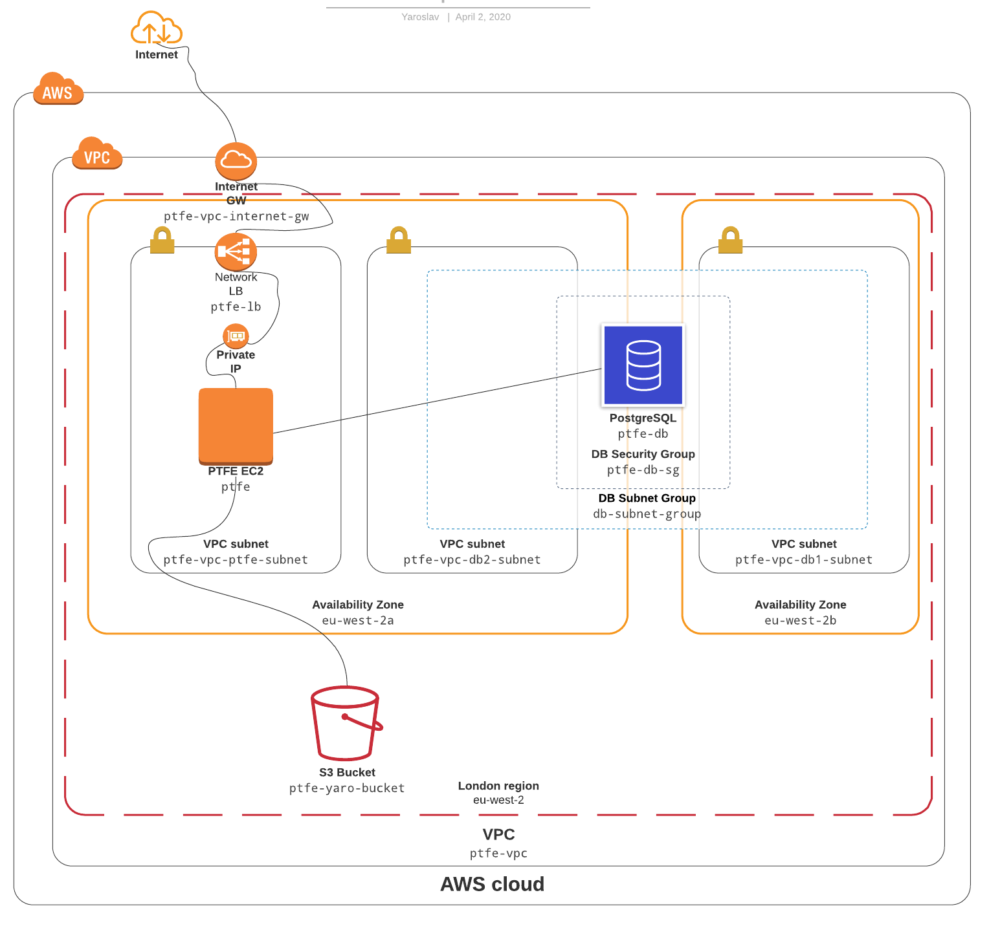

# Installing Terraform Enterprise in demo mode and recovering it from snapshot 

In this project we will build environment and Terraform Enterprise (PTFE) located in it. For that purpose we will use packer for generating ami image that later will be used for the ptfe instance.

Terraform Enterprise installation will be offline airgap installation.

## About Terraform Enterprise
Terraform Enterprise is on-prem version of Terraform Cloud. This means that it implements the functionality of Terraform Cloud in private managed and secured infrastructure with additional enterprise-grade architectural features like audit logging and SAML single sign-on.
Airgap installation means that no Internet access is required for the installation.

## AWS Enviroment
Environment consist of Network Balancer with two private networks one for ptfe instance and one for the database. There is also S3 Bucket. You can check diagram overview below:




### Prerequisites
- Install Terraform CLI:
Download and install accordingly to your OS as described here:
https://www.terraform.io/downloads.html
- Install Packer CLI:
Download and install accordingly to your OS as described here:
https://packer.io/downloads.html
- Have a account in AWS and populate the access and secret key in variables **aws_access_key** and **aws_secret_key** in variables.tf
- You have to have a domain and create zone in aws (https://docs.aws.amazon.com/Route53/latest/DeveloperGuide/CreatingHostedZone.html) and populate it id in variable **r53-zone-id** in variables.tf
- Obtain a license for TFE and located in ./ptfe-ec2/license-file.rli
- Download Airgap bundle for the install and save in ./ptfe-ec2/Terraform.airgap
- Download replicated and save it to ./ptfe-ec2/replicated.tar.gz from https://install.terraform.io/airgap/latest.tar.gz
- Create ssh keys for the ptfe instance and populate the public on in variable **ssh-public-key** in variables.tf
- Check ./ptfe-ec2/settings.json and ./ptfe-ec2/replicated.conf and change the needed setting that you will use.
- Populate the other variables and populate them accordingly in **replicated.conf**
- Create ssl certificates and put them in ./ptfe-ec2/cert.pem and  ./ptfe-ec2/privkey.pem

### Open a terminal


 OS system | Operation
 ------------ | -------------
| Windows | Start menu -> Run and type cmd |
| Linux  |Start terminal |
| macOS | Press Command - spacebar to launch Spotlight and type "Terminal," then double-click the search result. |

### Download this repo
- clone the repo locally
```
clone https://github.com/yaroslav-007/ptfe-aws-external-services-airgap.git
cd ptfe-aws-external-services-airgap.git
```
### Create AMI image 
We will user packer to create ami image. To do this perform the following:
```
cd packer
packer build template.json
```

When packer finish, it will output the ami uid. Populate it in variables.tf

### Run terrafom 

To deploy the infrastructure and ptfe instance perform the following:

```
cd ../ptfe
terraform apply -auto-approve
```

When terraform finished, open a browser for location `https://<the domain name you are using>:8800/` and PTFE console should be available.

